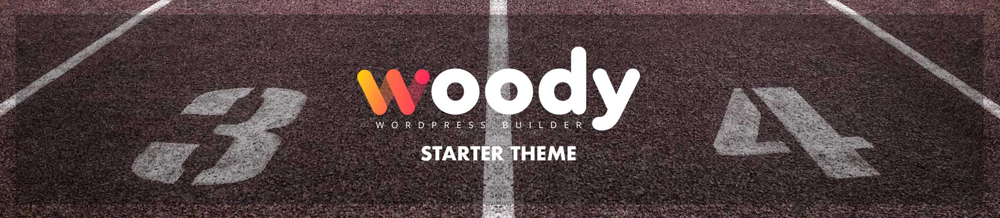

[](https://php.net/releases/)
[](https://packagist.org/packages/woody-wordpress/woody-theme)


[](https://twitter.com/raccourciagency)

* * *

Starter theme for Woody Wordpresss Builder.

## :fire: Installation & Usage

First, install Woody Theme via the Composer package manager:

```bash
composer require woody-wordpress/woody-theme
```

Then download this starter theme and put it in your Wordpress themes directory.

## :wrench: CSS
At the begining, there was [Foundation by Zurb framework](https://foundation.zurb.com/), enhanced with the [Woody Library](https://github.com/woody-wordpress/woody-library).
Read [the framework documentation](https://foundation.zurb.com/sites/docs/) and then, play with the theme :
- First, edit [the settings.scss file](https://github.com/woody-wordpress/starter-theme/blob/master/src/scss/settings/settings.scss)
- You can also override [the library's vars](https://github.com/woody-wordpress/woody-library/tree/master/assets/scss/vars) in [woody_vars.scss](https://github.com/woody-wordpress/starter-theme/blob/master/src/scss/settings/woody_vars.scss)
- Empty files are at your disposal to help you organize your css. It's up to you to use it or not.

## :metal: Contributors

Thank you to all the people who have already contributed to Woody Theme !

For future contributors, please read our [Contributor Covenant Code of Conduct](CODE_OF_CONDUCT.md)

<!-- Header photo by [John Lee on Unsplash](https://unsplash.com/@john_artifexfilms?utm_medium=referral&utm_campaign=photographer-credit&utm_content=creditBadge)<br/>
[](https://unsplash.com/@john_artifexfilms?utm_medium=referral&utm_campaign=photographer-credit&utm_content=creditBadge) -->

## :bookmark: License

Woody Starter Theme is open-sourced software licensed under the [GPL2](LICENSE).

## :crown: Sponsoring

Woody is a digital ecosystem co-financed by the Regional Tourism Committee of Brittany for [eBreizh Connexion](http://www.ebreizhconnexion.bzh)


